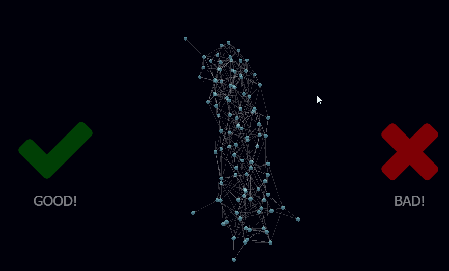

# Bot Brain

BotBrain is a set of artificial learning tools to automate an [Arduino](http://arduino.org)-based robot. 

Its been built as part of an educational workshop on artificial learning specifically for [International Nodebots Day](https://www.eventbrite.com.au/e/international-nodebots-day-melbourne-2017-tickets-34845310261). 

This material here is very basic and aimed more at communicating the core concept of a neural network through practice than dealing with all the theoretical stuff that is available out there.

## Interact with your robot's brain in 3D.

The key aspect of BotBrain is the ability to watch signals travel across your robot's neural network in 3D, and train it with positive and negative reinforcement.



## Quick start

You need [NodeJS](https://nodejs.org/en/download/) installed, version 6 or above.

```sh
$ mkdir my-bot && cd my-bot
$ npm install botbrain
$ npm start
```

The above will perform a quick test with a random visualization. For a full test you need to rig up a robot.

## Proper setup

You should be adding this to an existing robot project such as [johnny-five](http://johnny-five.io/).

Here is a longer example:

```sh
$ mkdir my-bot && cd my-bot
$ npm install johnny-five
$ npm install botbrain
```

### robot.js
```js
var five = require("johnny-five");
var botbrain = require("botbrain");

var board = new five.Board({port: process.argv[2] || "" });

board.on("ready", function() {

    var network = new botbrain.NeuralNetwork(32);

    // PROXIMITY SENSOR INPUT
    var input = new five.Proximity({ pin: 10, freq: 200, controller: "HCSR04" });
    input.on("change", () => network.input(input.value, 0));

    // WHEEL OUTPUT
    var servo1 = new five.Servo.Continuous(3);
    var servo2 = new five.Servo.Continuous(5);

    // Reactions to data can be arbitrary.
    // It doesnt matter what gets mapped to what since
    // the robot will learn to coordinate itself
    // using positive and negative feedback.

    var output1 = network.output(2); // 2-bit output (0-3)
    var output2 = network.output(2); // 2-bit output (0-3)

    output1.on("data", move.bind(servo1, data));
    output2.on("data", move.bind(servo2, data));

    function move(data) {
        switch(data) {
            case 1: // Forward
                return this.ccw();

            case 2: // Backward
                return this.cw();

            default: // Or Nothing
                return;
    	}
    }

    // DISPLAY VIA LOCAHOST

    var display = botbrain.Toolkit.visualise(network);

    console.log("Your brain is ready for interaction. Please open http://localhost:" + display.port);


});
```

Then run it!

```sh
$ node robot.js
```
