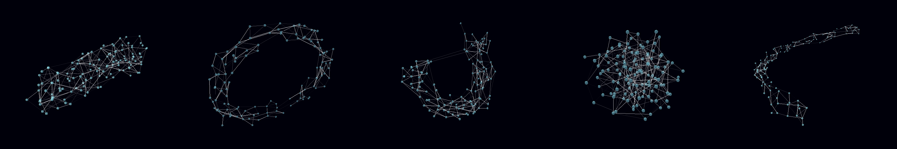

# Bot Brain

BotBrain is a set of artificial learning tools to automate an [Arduino](http://arduino.org)-based robot.

Its been built as part of an educational workshop on artificial learning specifically for [International Nodebots Day](https://www.eventbrite.com.au/e/international-nodebots-day-melbourne-2017-tickets-34845310261).

This material here is very basic and aimed more at communicating the core concept of a neural network through practice than dealing with all the theoretical stuff that is available out there.

## Interact with your robot's brain in 3D.

The key aspect of BotBrain is the ability to watch signals travel across your robot's neural network in 3D, and train it with positive and negative reinforcement.


## Quick start

You need [NodeJS](https://nodejs.org/en/download/) installed, version 6 or above.

```sh
$ mkdir my-bot && cd my-bot
$ npm install botbrain
$ npm start
```

The above will perform a quick test with a random visualization. For a full test you need to rig up a robot.

## Proper setup

You should be adding this to an existing robot project such as [johnny-five](http://johnny-five.io/).

Here is a longer example:

```sh
$ mkdir my-bot && cd my-bot
$ npm install johnny-five
$ npm install botbrain
```

### robot.js
```js
var five = require("johnny-five");
var botbrain = require("botbrain");

var board = new five.Board({port: process.argv[2] || "" });

board.on("ready", function() {

    var network = new botbrain.NeuralNetwork(32);

    // PROXIMITY SENSOR INPUT
    var proximity = new five.Sensor({ pin: "A6", freq: 200 });
    proximity.on("change", () => network.input(proximity.value));

    // MOTOR OUTPUT
    var motor_l = new five.Motor({ pins: { pwm: 6, dir: 7, }, invertPWM: true, });
    var motor_r = new five.Motor({ pins: { pwm: 9, dir: 8, }, invertPWM: true, });

    // Reactions to data can be arbitrary.
    // It doesnt matter what gets mapped to what since
    // the robot will learn to coordinate itself
    // using positive and negative feedback.

    var output1 = network.output(2); // 2-bit output (0-3)
    var output2 = network.output(2); // 2-bit output (0-3)

    output1.on("data", move.bind(motor_l));
    output2.on("data", move.bind(motor_r));

    function move(data) {
    	switch(data) {
            case 1: // Forward
                return this.forward();
            case 2: // Backward
                return this.reverse();
            case 3: // Or Stop
                return this.stop();
    	}
    }

    // DISPLAY VIA LOCAHOST (http.Server)
    var server = botbrain.Toolkit.visualise(network);
    var address = server.address();

    console.log('Bot brain ready for interaction. Please open http://localhost:' + address.port);

});
```

Then run it!

```sh
$ node robot.js
```
## API :: NeuralNetwork

NeuralNetwork is a class in the botbrain module and can be loaded in the following ways:

```
import { NeuralNetwork } from 'botbrain'; // ES6  

const NeuralNetwork = require('botbrain').NeuralNetwork; // Node, CommonJS

const NeuralNetwork = (window || this).botbrain.NeuralNetwork; // Browser, in global context
```

### new NeuralNetwork(size, opts)

Generates a neural network.

- **`size`**: The number of neurons in the neural network
- **`opts`**: A map of settings for the network
    - `.shape`: Choice of 'tube', 'ring', 'ball', 'sausage', 'snake', or any other in [NetworkShaper.js](src/NetworkShaper.js). Defaults to 'tube'.
    - `.shaper`: The [shaper function](#shaper-function) used for giving shape to the network. If available will ignore `.shape`.
    - `.connectionsPerNeuron`: Average synapses per neuron. Defaults to `4`.
    - `.signalSpeed`: Speed in neurons per second. Defaults to `20`.
    - `.signalFireThreshold`: Threshold (between 0 and 1) needed to trigger onward neurons. Defaults to `0.3`.
    - `.learningRate`: Max increase/decrease to connection strength when learning. Defaults to `0.15`.
    - `.learningPeriod`: Milliseconds in the past on which learning applies. Defaults to `60000` ms.
    - `.messageSize`: Number of neurons involved in each input/output channel. Defaults to `10` bits (ie 2^10 = 0-1024).

For example, to create a network of 100 neurons using all default options:

```
let network = new NeuralNetwork(100);
```

To create a ring-shaped network of 100 neurons with double the speed and learning rate.

```
let network = new NeuralNetwork(1000, { shape: 'ring', signalSpeed: 40, learningRate: 0.3 });
```

If a `String` is passed in as the `opts` parameter, its interpreted as the network shape.

```
let network = new NeuralNetwork(100, 'ring');
```

If a `Function` is passed as the `opts` parameter, its interpreted as the [shaper function](#shaper-function), see examples in [NetworkShaper.js](src/NetworkShaper.js).

```
let network = new NeuralNetwork(100, (index, size) => Math.floor(Math.random() * size));
```

### Shaper Function

A shaper is a function that determines the shape of the network by returning the likely onward connections made by each neuron. 

For example, if a neuron is connected to other neurons at random, the final shape of the network will be a ball. If its connected to nearby neurons the shape will be more of a snake or cylinder. If neurons close to the end are linked to neurons at the beginning, the end product will be more of a ring or a doughnut.



A shaper function has two inputs: 

- **`index`**: The node position in the `nodes` array. In a network of 10 nodes, the first node has an index of 0, the last node an index of 9.
- **`size`**: The total number of nodes in the network. This is useful for linking up the end of the network or for discarding links outside the network.

And returns:

 - **`index`**: The `index` position of an onward neuron (for connecting to it). 

Bear in mind that the onward connection should be a *variable random number*, as the shaper will be executed several times per neuron, and if a neuron has 4 connections you will want these to connect to different onward neurons.

For example:

```js
// Random ball shape
const ball = function (index, size) {
    const i = Math.floor(Math.random() * size); // pick any onward neuron at random
    if (i === index) return null; // reject it if it connects back to same neuron
    return i; // otherwise return it
}
```

There are more examples in [NetworkShaper.js](src/NetworkShaper.js).
